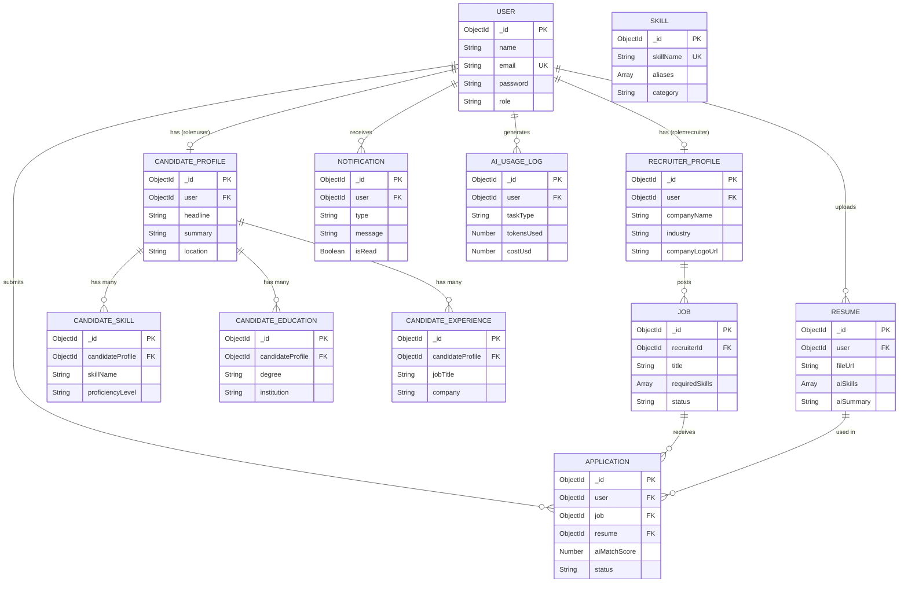

# 📊 SkillMatch AI — Complete Data Model Overview

> This folder contains all MongoDB collections (Mongoose schemas) for the SkillMatch AI platform.
> Every document schema follows proper Mongoose structure with ObjectId references for inter-collection relationships.

---

## 🗂️ Collections Index

| # | Collection Name | File | Description |
|---|----------------|------|-------------|
| 1 | `users` | [01_user.md](./01_user.md) | Core user authentication (Job Seeker & Recruiter) |
| 2 | `candidate_profiles` | [02_candidate_profile.md](./02_candidate_profile.md) | Job Seeker extended profile info |
| 3 | `recruiter_profiles` | [03_recruiter_profile.md](./03_recruiter_profile.md) | Recruiter / Company profile info |
| 4 | `candidate_skills` | [04_candidate_skill.md](./04_candidate_skill.md) | Skills with proficiency per candidate |
| 5 | `candidate_educations` | [05_candidate_education.md](./05_candidate_education.md) | Education history per candidate |
| 6 | `candidate_experiences` | [06_candidate_experience.md](./06_candidate_experience.md) | Work experience per candidate |
| 7 | `resumes` | [07_resume.md](./07_resume.md) | Uploaded resumes with AI analysis results |
| 8 | `jobs` | [08_job.md](./08_job.md) | Job postings created by recruiters |
| 9 | `applications` | [09_application.md](./09_application.md) | Job applications (User→Job link) |
| 10 | `notifications` | [10_notification.md](./10_notification.md) | In-app notification system |
| 11 | `skills` | [11_skill.md](./11_skill.md) | Master skills dictionary with aliases |
| 12 | `ai_usage_logs` | [12_ai_usage_log.md](./12_ai_usage_log.md) | OpenAI API cost & token tracking |

---

## 🔗 Entity Relationship Diagram

---

## 🧭 Relationship Summary

| Parent Collection | Child Collection | Relationship Type | Foreign Key Field |
|-------------------|-----------------|-------------------|-------------------|
| `users` | `candidate_profiles` | One-to-One | `candidate_profiles.user → users._id` |
| `users` | `recruiter_profiles` | One-to-One | `recruiter_profiles.user → users._id` |
| `users` | `resumes` | One-to-Many | `resumes.user → users._id` |
| `users` | `applications` | One-to-Many | `applications.user → users._id` |
| `users` | `notifications` | One-to-Many | `notifications.user → users._id` |
| `users` | `ai_usage_logs` | One-to-Many | `ai_usage_logs.user → users._id` |
| `candidate_profiles` | `candidate_skills` | One-to-Many | `candidate_skills.candidateProfile → candidate_profiles._id` |
| `candidate_profiles` | `candidate_educations` | One-to-Many | `candidate_educations.candidateProfile → candidate_profiles._id` |
| `candidate_profiles` | `candidate_experiences` | One-to-Many | `candidate_experiences.candidateProfile → candidate_profiles._id` |
| `users` (recruiter) | `jobs` | One-to-Many | `jobs.recruiterId → users._id` |
| `jobs` | `applications` | One-to-Many | `applications.job → jobs._id` |
| `resumes` | `applications` | One-to-Many | `applications.resume → resumes._id` |
