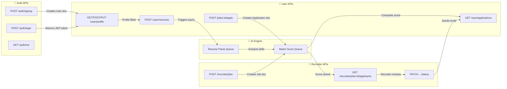

# 🔌 SkillMatch AI — Complete API List

> This folder documents **every** backend API endpoint for the SkillMatch AI platform.
> Each API includes its purpose, HTTP method, auth requirements, related ObjectId references, and how it connects to other APIs.

---

## 📁 Files in this Folder

| # | File | Module | APIs Count |
|---|------|--------|------------|
| 1 | [01_auth_apis.md](./01_auth_apis.md) | Authentication | 5 endpoints |
| 2 | [02_user_profile_apis.md](./02_user_profile_apis.md) | User Profile & Settings | 15 endpoints |
| 3 | [03_resume_apis.md](./03_resume_apis.md) | Resume Management | 5 endpoints |
| 4 | [04_job_public_apis.md](./04_job_public_apis.md) | Public Job Listings | 3 endpoints |
| 5 | [05_job_application_apis.md](./05_job_application_apis.md) | Job Applications (User) | 3 endpoints |
| 6 | [06_recruiter_profile_apis.md](./06_recruiter_profile_apis.md) | Recruiter Profile | 4 endpoints |
| 7 | [07_recruiter_job_apis.md](./07_recruiter_job_apis.md) | Recruiter Job Management | 7 endpoints |
| 8 | [08_recruiter_applicant_apis.md](./08_recruiter_applicant_apis.md) | Recruiter Applicant Pipeline | 7 endpoints |
| 9 | [09_notification_apis.md](./09_notification_apis.md) | Notifications | 3 endpoints |
| 10 | [10_ai_admin_apis.md](./10_ai_admin_apis.md) | AI & Admin | 3 endpoints |

**Total: ~55 API endpoints**

---

## 🧭 API Route Prefix Mapping

| Prefix | Module | Auth Required | Role |
|--------|--------|---------------|------|
| `/api/v1/auth/*` | Authentication | ❌ (except `/me`, `/logout`) | Any |
| `/api/v1/user/*` | User Dashboard | ✅ Bearer JWT | `user` |
| `/api/v1/jobs/*` | Public Job Listings | ❌ (public) / ✅ (apply) | Any / `user` |
| `/api/v1/recruiter/*` | Recruiter Dashboard | ✅ Bearer JWT | `recruiter` |
| `/api/v1/notifications/*` | Notifications | ✅ Bearer JWT | Any |
| `/api/v1/skills/*` | Skills Autocomplete | ❌ (public) | Any |
| `/api/v1/admin/*` | Admin Reports | ✅ Bearer JWT | `admin` |

---

## 🔗 API Data Flow Diagram



---

## 📌 General API Response Format

```json
// ✅ Success
{
  "success": true,
  "message": "Operation completed successfully",
  "data": { ... }
}

// ❌ Error
{
  "success": false,
  "message": "Descriptive error message",
  "errors": [ ... ] // Optional: validation errors
}
```
