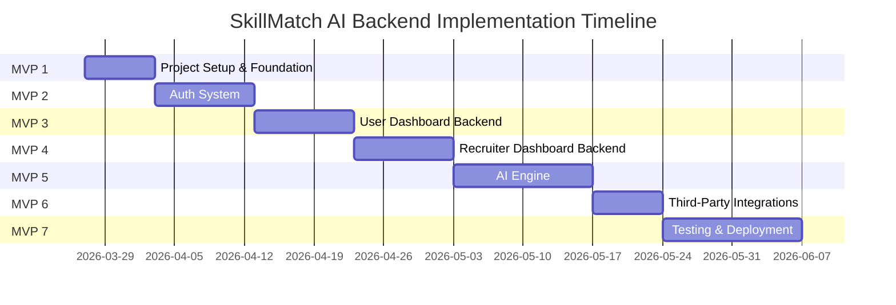

# 🚀 SkillMatch AI — Implementation Steps

> Phase-wise, step-by-step implementation guide covering all 7 MVPs.
> Each phase is a separate `.md` file with actionable tasks.

---

## 📁 Phase Files

| # | File | MVP | Duration | Focus |
|---|------|-----|----------|-------|
| 1 | [phase_01_project_setup.md](./phase_01_project_setup.md) | MVP 1 | Week 1 | Project structure, backend foundation |
| 2 | [phase_02_auth_system.md](./phase_02_auth_system.md) | MVP 2 | Week 2-3 | Authentication, JWT, role-based access |
| 3 | [phase_03_user_dashboard_backend.md](./phase_03_user_dashboard_backend.md) | MVP 3 | Week 3-4 | User profile, resume, job APIs |
| 4 | [phase_04_recruiter_dashboard_backend.md](./phase_04_recruiter_dashboard_backend.md) | MVP 4 | Week 5-6 | Recruiter profile, job posting, pipeline APIs |
| 5 | [phase_05_ai_engine.md](./phase_05_ai_engine.md) | MVP 5 | Week 7-8 | AI resume parsing, match scoring, Bull queues |
| 6 | [phase_06_integrations.md](./phase_06_integrations.md) | MVP 6 | Week 9 | Cloudinary, Email, Notifications, Cost tracking |
| 7 | [phase_07_testing_deployment.md](./phase_07_testing_deployment.md) | MVP 7 | Week 10-12 | Testing, documentation, CI/CD, deployment |

---

## 📋 Implementation Order (Critical Path)



---

## ⚡ Quick Start

```bash
cd skillmatch-ai-backend
npm install
cp .env.example .env   # Fill in your values
npm run dev             # Start with nodemon
```
